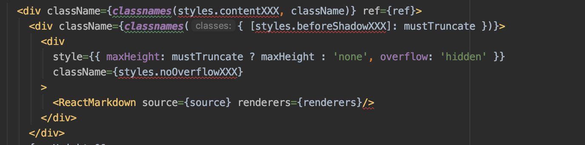

# WebStormPlugins
Simple inspections to highlight unknown CCS classes used in 'classname' and to highlight console.logs in production code

### Search for Unknown CSS:

```
       <Components className={styles.XYZ}>
        ...
       </Components>
```
 where XYZ is not found in imported **styles**
 
 Example:
 

 

### Search for console usages in PROD
  
```
      console.log('XYZ') in PRODUCTION (non tests) files
```
